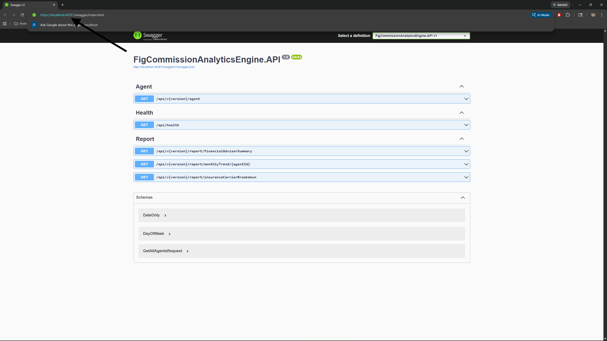
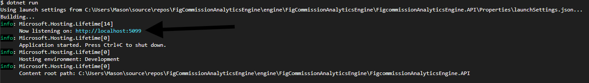
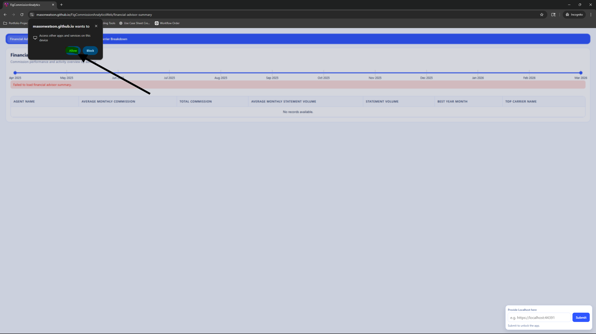
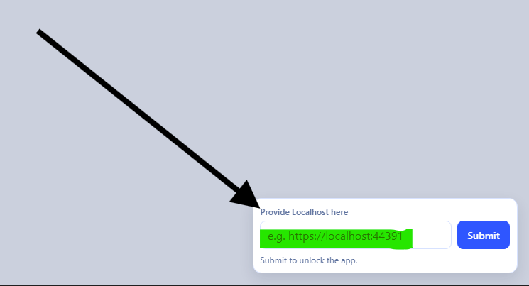

# Fig Commission Analytics System

## Project Setup

### **1.1. Clone and Run solution with IIS**

```bash
cd C:\
git clone https://github.com/masonwatson/FigCommissionAnalyticsAPI.git
```

1. Navigate to C:\FigCommissionAnalyticsAPI\engine\FigCommissionAnalyticsEngine\
2. Open the .sln
3. Build the Solution
4. Make sure FigCommissionAnalyticsEngine.API is the startup project
5. Run with IIS Express
6. Copy the localhost base url with the port number (*e.g. https://localhost:44391*)



### **1.2. Or Clone and Restore**

```bash
cd C:\
git clone https://github.com/masonwatson/FigCommissionAnalyticsAPI.git
cd FigCommissionAnalyticsAPI/engine/FigCommissionAnalyticsEngine
dotnet restore
cd FigCommissionAnalyticsEngine.API
dotnet run
```
1. Copy the localhost base url with the port number (*e.g. http://localhost:5099*)



### **2. Navigate to the Website**

https://masonwatson.github.io/FigCommissionAnalyticsWeb/financial-advisor-summary

### **3. Click Allow On the Popup**
Please click the "allow" option on this popup, as it allows for the web-hosted client side to talk to the locally-hosted API. If you would rather run the client side locally, there are additional instructions below; there will be watermarks on the UI as I used Kendo UI.



### **4. Enter the Localhost Base Url with the Port Number into the Website's Input**



## Troubleshooting Client Side

If the website does not accept the localhost, it might be due to a CORS error. In that case, please clone the FigCommissionAnalyticsWeb repo and run it locally.
```bash
cd C:\
git clone https://github.com/masonwatson/FigCommissionAnalyticsWeb.git
cd FigCommissionAnalyticsWeb
npm install
ng serve --open
```
